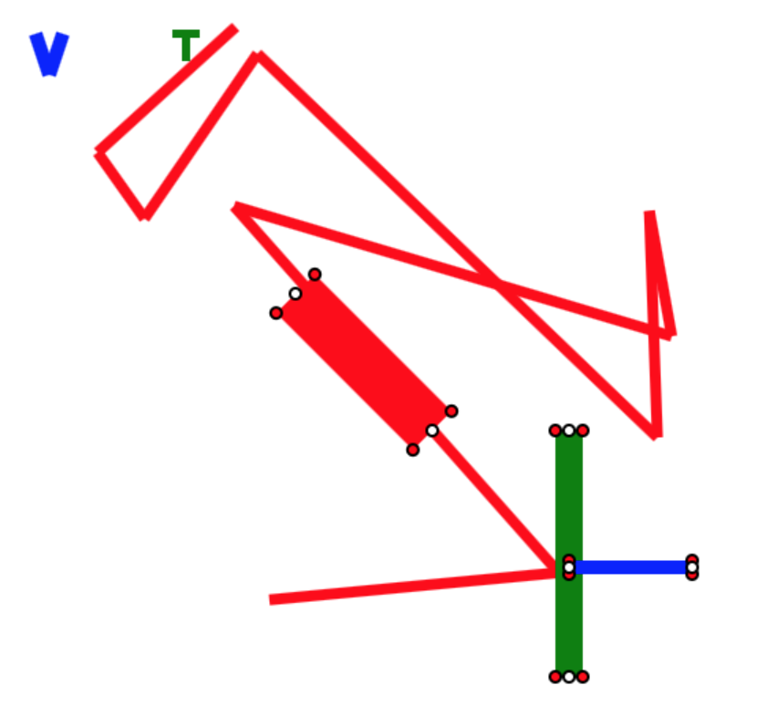

# Polyline to Polygon(s)

Experimentations around converting a line into shapes. The line might cross itself.

Current status:
* Due to the complexity of intersections, currently each line segment is converted to its own non-intersecting polygon (either a quadrilateral or 2 triangles, based on the config).

Open Issues:
* The joints between the line segments need to become smoother. Ideally the code would be able to draw like different types of brushes.
* Performance: While this works, it might be very inefficient and further study is needed to find out how good of an approach the current one represents. 